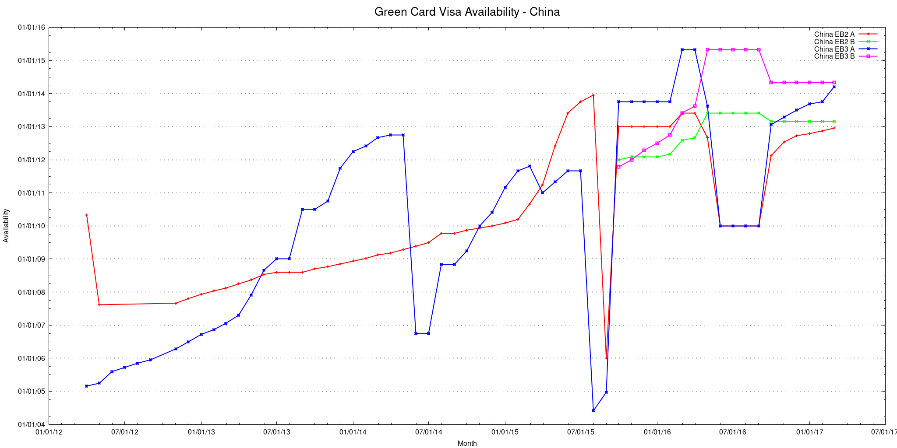

VisaBulletinScraper is a program that extracts Visa Bulletin information from [the Department of State website](https://travel.state.gov/content/visas/en/law-and-policy/bulletin.html).

If you are waiting for your green card, using this to get statistics may help you make sound decisions.

    stack setup
    stack build
    stack exec VisaBulletinScraper-exe

`app/Main.hs` contains a few options to tweak at the top.  Currently this program only extracts employment-based visa information but can be easily adapted to work with other types.

The program will spit out `VisaBulletin.csv` and `VisaBulletinUnpivoteD.csv`.  If you have `gnuplot` and `perl` you can use the stuff under `plotting/`:

    cd plotting/
    ./extract.pl ../VisaBulletinUnpivoted.csv
    gnuplot plot-script

to produce beautiful pictures like this one:

TODO:
- Plotting using Haskell?
- Oct 2012 is skipped somehow.
- `getNumRows` could be smarter?
- Need another scraper for <= 2012 march.
