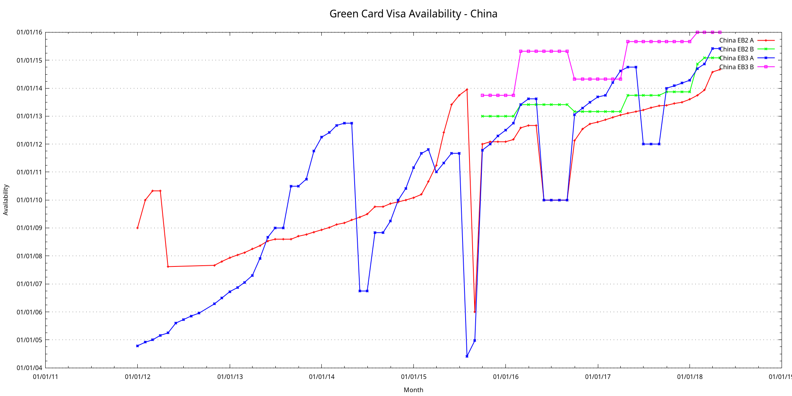

VisaBulletinScraper is a program that extracts Visa Bulletin information from [the Department of State website](https://travel.state.gov/content/visas/en/law-and-policy/bulletin.html).

If you are waiting for your green card, using this to get statistics may help you make sound decisions.

    stack setup
    stack build
    stack exec VisaBulletinScraper-exe

`app/Main.hs` contains a few options to tweak at the top.  Currently this program only extracts employment-based visa information but can be easily adapted to work with other types.

The program will spit out `VisaBulletin.csv` and `VisaBulletinUnpivoted.csv`.  The latter is good for importing into databases and plotting.  I implemented two ways of plotting.

1. Use [Google Charts](https://developers.google.com/chart/):

        cd plotting/google-charts/
        ./extract-for-google-charts.pl ../../VisaBulletinUnpivoted.csv > charts.html

  [link to interactive chart](https://rawgit.com/harryxp/VisaBulletinScraper/master/plotting/google-charts/charts.html)

2. Use `gnuplot` and `perl`:

        cd plotting/gnuplot/
        ./extract-for-gnuplot.pl ../../VisaBulletinUnpivoted.csv
        gnuplot plot-script

  

TODO:
- Plotting using Haskell?
- `getNumRows` could be smarter?
- Need another scraper for <= 2012 march.
- Oct 2012 is skipped - it has an irregular URL.
- Find URLs from https://travel.state.gov/content/visas/en/law-and-policy/bulletin.html .
- plotting/google-charts/extract-for-google-charts.pl can be improved.
